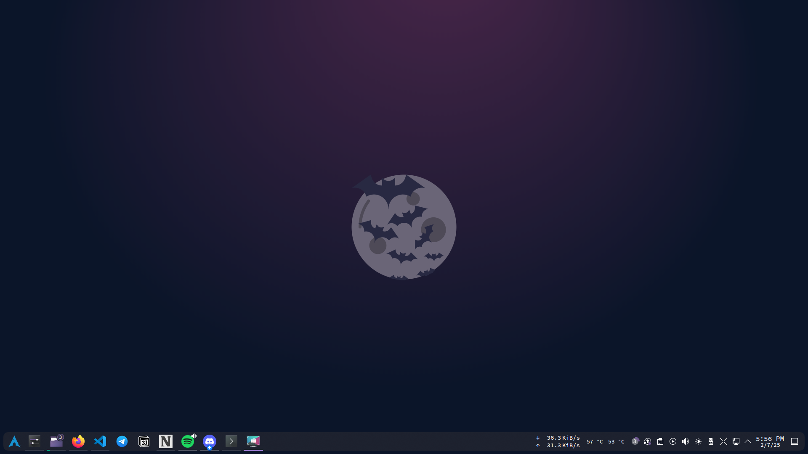
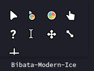
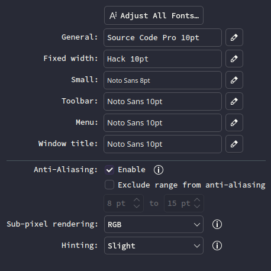
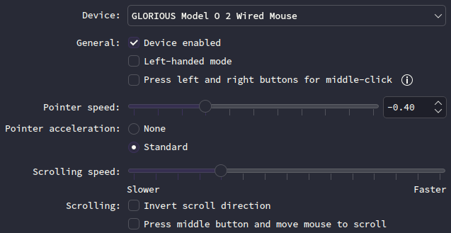

# KDE Plasma
My **KDE Plasma** desktop look like this:

# Colors & Theme
### Global Theme
My Global Theme is set to **[Dracula](https://draculatheme.com/)**.

### Colors
My accent color is set to purple (**[#926ee4](https://tools.atatus.net/tools/color-code-viewer#926ee4)**).

### Application Style
My application style is set to **[Breeze](https://github.com/KDE/breeze)**.

### Plasma Style
My plasma style is set to **[Dracula](https://draculatheme.com/)**.

### Window Decorations
My window decorations is set to **[Breeze](https://github.com/KDE/breeze)**.

### Icons
My icons is set to **[Breeze Dark](https://github.com/KDE/breeze)**.

### Cursors
My cursors is set to **Bibata-Modern-Ice**, it look like this:

### Spash Screen
My splash screen is set to **Kuro**, what a beautiful black cat (they are the best).

### SDDM
My login screen is set to **Dracula-Plasma6**.

# Wallpaper
The wallpaper is the default one from the **[Dracula](https://draculatheme.com/)** theme (Purplish).

# Fonts
Here is my **fonts** config:

# Taskbar
On my taskbar i have 2 widget:
- Netspeed widget
- Thermal monitor

### Netspeed widget
The Netspeed widget displays my upload & download usage.

### Thermal Monitor
The Thermal Monitor shows my CPU & GPU temperature.

# Mouse
Here is my **mouse** config:

