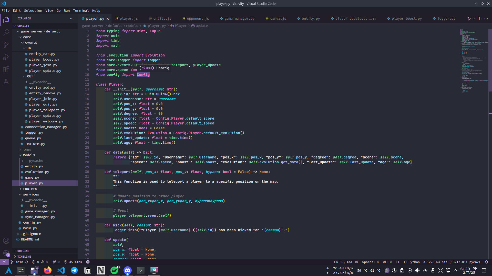

# Visual Studio Code
My **Visual Studio Code** look like this:

# Extensions
- indent-rainbow
- python
- vscode animations
- wakatime
- discord rich presence
- c/c++

# Theme
I use **[Omni Dracula Theme](https://marketplace.visualstudio.com/items?itemName=ThiagoLcioBittencourt.omni-dracula-theme)**, i like it because the colors are cheerful.

# Fonts
For the font i use **[JetBrains Mono](https://www.jetbrains.com/fr-fr/lp/mono/)** in **bold**.